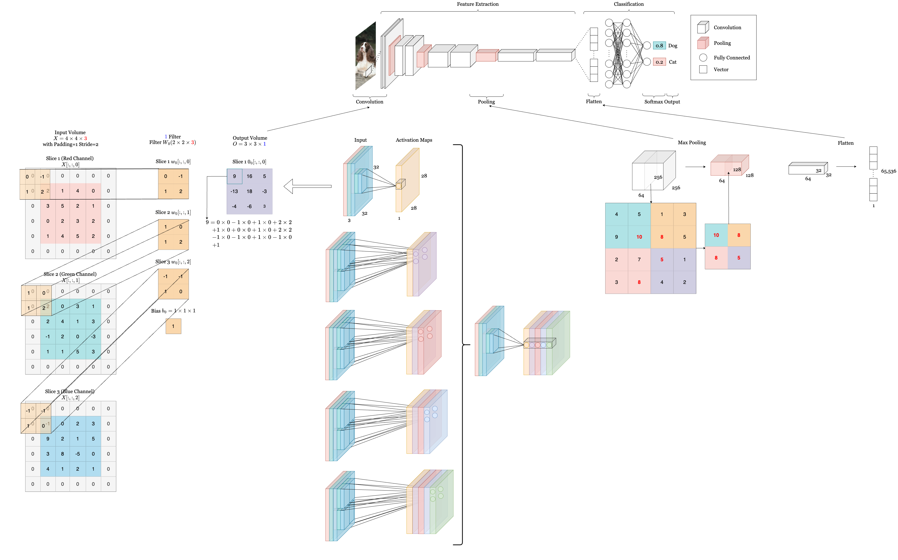
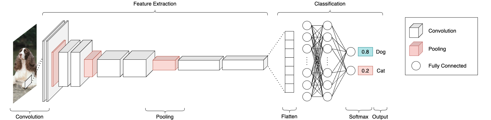
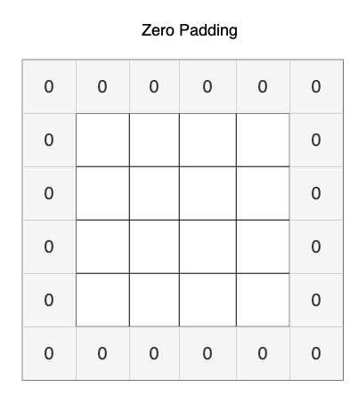
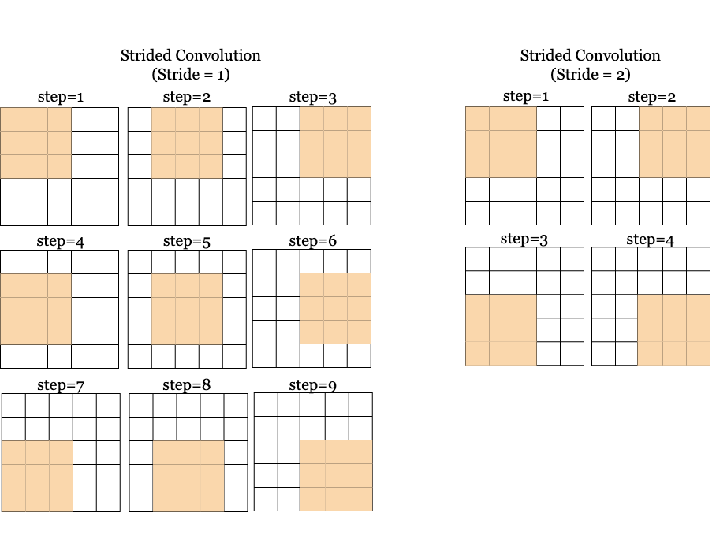
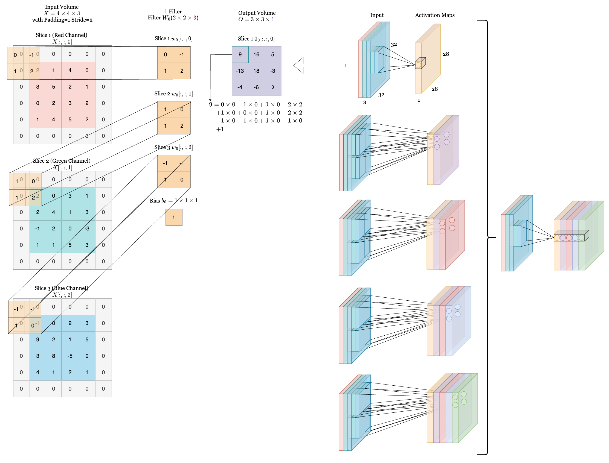
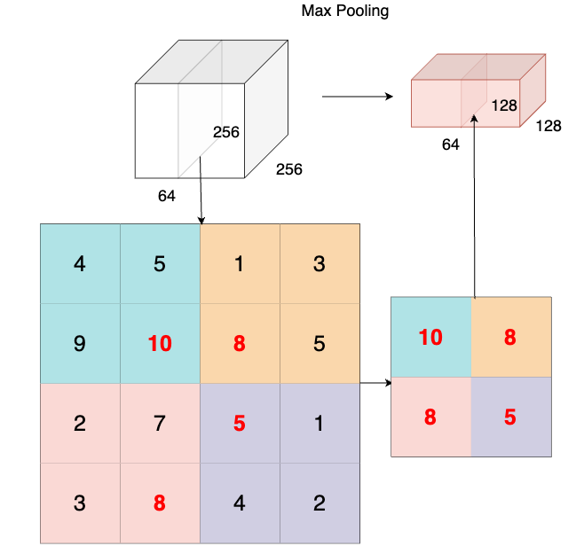
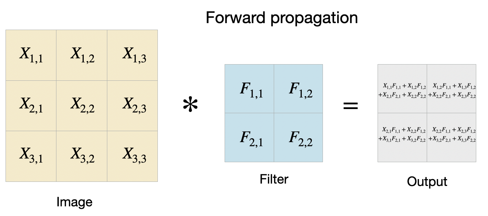
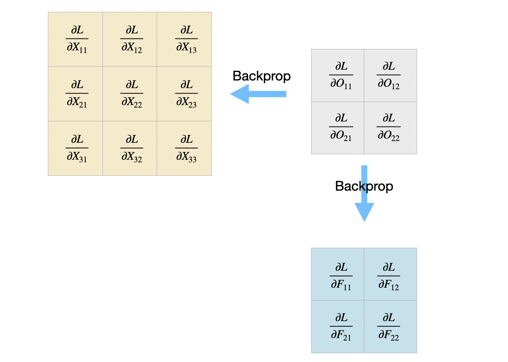
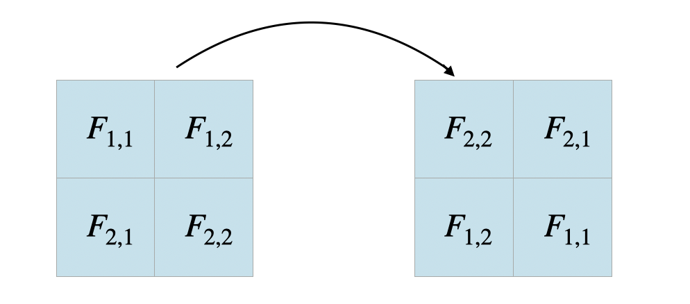

# CS5782 Notes: Convolutional Neural Networks (CNNs)

## Introduction

Convolutional Neural Networks (CNNs) are a type of Neural Network that is primarily designed for processing visual signals, such as image or video-related data [1] (not exclusively on images, for example, AlphaZero). The overall structure of CNN is similar to ordinary neural networks, but it has some special properties designed specifically for image processing. Before deep diving into the architecture of CNNs, let’s first recall what Multi-Layer Perceptron (MLP) is, what MLP can do and what the limitations of MLP are in the computer vision field. 

As we have seen in the previous chapters, MLP consists of several fully connected layers, where each neuron in one layer is connected to every neuron in the previous layer. The input is passed through several nonlinear hidden layers, and the output could be numerical in a regression task or class probability in a classification task. 

However, MLPs are not well-suited for processing high-dimensional structured data like images. For example, say we want to classify a set of cat and dog images of size 128 * 128, each of which has 3 color channels as they are RGB images. The first step is to flatten the image to a vector of dimension 49152 (128*128*3). Suppose the next hidden layer has 1000 neurons (not very large compared to 49152), the number of parameters for this single layer would be 49152 * 1000 = 49152000. This is only for one layer. Imagine building a neural network with multiple layers using higher resolution images, say 1024 * 1024, the number of parameters grows quickly! Training such neural networks on GPUs is difficult or even infeasible. 

Additionally, MLP is not good at capturing spatial relations and is sensitive to translation variance. Intuitively, the position of a dog in an image should not affect the classification result, whether it’s a dog or a cat. However, since MLPs treat each input pixel as independent and fixed in position, even a small spatial shift results in significantly different input vectors. This shift can drastically affect the output, even though the images are semantically identical. 

To address these issues, CNNs were brought up! Convolutional Neural Networks have the advantage of translation invariance and locality of an image input. Translation invariance means the network's output remains the same regardless of the position of an object within the image. Locality means pixels close to each other are more correlated than distant ones. 

## Architecture Overview

The CNN architecture is designed to gradually extract increasingly abstract and complex features, starting from raw pixels to low-level features to high-level features. It consists of three main types of layers: a convolutional layer, a pooling layer, and a fully connected layer. 

1. **Convolutional Layer**: Convolutional layers perform the core operation of CNNs using filters/kernels that slide across the input to produce feature maps. A convolutional layer is essentially a set of convolutional filters and each convolutional filter creates a feature map from the input.

2. **Pooling Layer**: Pooling layers downsample the feature map and highlight the most present feature. They also reduce the feature map size and increases the receptive field.
3. **Fully Connected Layer**: Fully connected layers are exactly the same as how we used them in MLPs. Each neuron in the layer is connected to all the neurons in the previous layer. If we are using CNN in a classification task, the number of neurons in the last fully connected layer should be the same as the number of classes.

The picture below shows a complete structure and essential components of CNN. Don’t be scared! We will go through each one of them and understand how they function individually as well as together to make up CNN.

## CNN Building Blocks

After the short introduction above and motivations behind the design of CNN, let’s dive deep into the building blocks of the architecture to better understand how it excels at processing visual signals!

### Convolutional Layer

The Conv layer is the core building block of CNNs and performs the majority of the computational work. Its main function is to apply a set of filters (or kernels) to the input data to extract features like edges, shapes, and textures.

#### Components:
- **Kernel/Filter**: Filters are small spatially (in width and height), but extend through the full depth of the input volume. During the forward pass, the filter slides over the input data (convolution) and computes the dot product between the filter and the input at each position. The output is an activation map that represents the feature the filter detects (e.g., edges, colors, patterns).
  - **Example**: A first-layer filter might have a size of 5x5x3 (5 pixels wide and tall, with 3 corresponding to the 3 color channels in a RGB image).

- **Padding**: Padding ensures the output volume retains the same spatial dimensions as the input, especially when stride = 1. In the example shown below, the zero padding is simply adding rows and columns of zeros around the pixels to retain dimension. 

- **Stride**: The stride defines how much the filter moves at each step. Larger strides reduce the spatial dimensions of the output, potentially losing finer details. In Figure 2, it shows how a filter of size 3*3 slides through the input slice with a stride = 1.
  1. Stride=1: Filter moves by 1 pixel at a time, leading to larger output volumes.
  2. Stride=2: Filter moves by 2 pixels, producing smaller output volumes.
  

#### Dimension Calculation

Spatial output size can be calculated based on input size, kernel size, padding, and stride.
- **Input Volume:** Dimensions **$W_1 × H_1 × D_1$**

- **Required Hyperparameters:**
  - **$K$** – Number of filters  
  - **$F$** – Filter size (spatial extent)  
  - **$S$** – Stride  
  - **$P$** – Zero-padding  

- **Output Volume:** Dimensions **W₂ × H₂ × D₂**, calculated as:
  - $W_2 = \left \lfloor{\frac{W_1 - F + 2P}{S}}\right \rfloor + 1$
  - $H_2 = \left \lfloor{\frac{H_1 - F + 2P}{S}}\right \rfloor + 1$
  - $D_2 = K$

  _Note: Width and height are computed identically due to symmetry._

- **Learnable Parameters (with weight sharing):**
  - Each filter has $F \cdot F \cdot D_1$ weights
  - Total parameters: $(F \cdot F \cdot D_1) \cdot K$ weights + **K biases**

#### Characteristics

- **Local Connectivity**: Instead of connecting neurons to every other neuron in the previous layer, local connectivity restricts each neuron to a small region of the input, i.e., the receptive field. This is a region that each neuron in the Conv layer looks at, typically equivalent to the filter size. The depth of the connectivity always matches the depth of the input volume (e.g., 3 for color images), but the spatial dimensions (width and height) are localized to the size of the filter.

- **Parameter Sharing**: Parameter sharing reduces the number of parameters by using the same set of weights for all spatial positions in a depth slice. Each depth slice in the input volume shares the same weights, which means instead of having a unique set of weights for each spatial position, one set of weights is applied across all positions in that depth slice. This leads to fewer parameters and reduces computation.

#### Types of Convolution
There are some common types of convolutions that people use. 

- **1×1 Conv**: The 1x1 convolution is used to reduce the number of channels (depth) without affecting spatial dimensions (width and height). It applies a filter of size 1x1 across all input channels to combine features across depth, typically for dimensionality reduction or feature compression.
- **3x3 Conv**: The 3x3 convolution is a commonly used filter size that captures small spatial patterns like edges or textures. When two 3x3 conv layers are stacked, the receptive field of the second layer's output is a function of a 5x5 region in the input image. Therefore, two 3x3 conv layers, when stacked, can effectively capture the same information as a single 5x5 conv layer, yet with fewer parameters. 
- **2D Conv**: A 2D convolution operates on two-dimensional spatial data (height and width). [Pytorch Conv2d](https://pytorch.org/docs/stable/generated/torch.nn.Conv2d.html)
- **3D Conv**: A 3D convolution is used for volumetric data (height, width, and depth), typically used in tasks like video processing or medical imaging (e.g., MRI scans). It applies a filter over 3D inputs, capturing spatial and temporal (or depth) relationships. [Pytorch Conv3d](https://pytorch.org/docs/stable/generated/torch.nn.Conv3d.html)
- **Dilated Conv**: Dilated convolutions [7] introduce gaps (or dilation) between the elements of the convolutional filter. Instead of using a contiguous 3x3 filter, a dilated 3x3 filter "skips" certain input pixels, effectively increasing the receptive field without increasing the number of parameters or computational cost. It has 2 main advantages:
  - **Larger receptive field**: It allows the model to capture wider contextual information with fewer parameters. For example, a dilated 3x3 convolution with a dilation factor of 2 can capture a receptive field equivalent to a 5x5 convolution but with fewer parameters.
  - **Efficient for tasks like segmentation**: Dilated convolutions are especially useful in tasks like semantic segmentation, where it's important to capture long-range dependencies in the image without losing resolution.

### Demo
Below we show a demo of how convolution happens. On the right, we have an input of size 32*32*3 for a RGB image and the first convolution layer. With a filter size of 5*5*3, the resulting activation map is of dimension 28*28*1. If we use 5 filters in total, then the resulting volume will be size of 28*28*5, where each filter’s activation maps are stacked together as shown on the far right. Note that each neuron in the convolutional layer is connected to a local spatial region of the input volume, but spans the entire depth (i.e., all color channels). In this example, there are 5 neurons along the depth dimension, each looking at the same region of the input. The lines connecting these 5 neurons do not indicate shared weights; instead, they show that the neurons are focused on the same receptive field. Although these neurons are looking at the same region, each is associated with a different filter, meaning they do not share weights. On the left, we provide a short example of calculation of the output volume. (The dimension of filters are only for demonstration purpose. They do not scale to the accurate size.)

[Here](https://cs231n.github.io/convolutional-networks/) is also a great resource to see how convolution happens actively!

### Pooling Layer

Pooling operates independently on every depth slice of the input. The operation reduces the width and height of each depth slice, while the depth remains unchanged. The Pooling Layer is inserted between Convolutional Layers to:
- Reduce spatial size of the representation.
- Reduce the number of parameters and computation, which helps in faster processing and lower memory usage.
- Control overfitting by downsampling, which forces the model to focus on more prominent features rather than overfitting to small details.

In the following example, we can see how a depth slice is downsampled from size 4*4 to a size of 2*2 by max pooling. Notice how only spatial dimension is reduced (256*256 -> 128*128) while the depth is maintained (64 -> 64). 

### Pooling Layer Computation

- **Input Volume:** Dimensions **$W_1 × H_1 × D_1$**

- **Required Hyperparameters:**
  - **$F$** – Filter size (spatial extent)  
  - **$S$** – Stride

- **Output Volume:** Dimensions **W₂ × H₂ × D₂**, computed as:
  - $W_2 = \frac{W_1 - F}{S} + 1$  
  - $H_2 = \frac{H_1 - F}{S} + 1$  
  - $D_2 = D_1$

- **Parameters:**  
  - This layer introduces **no learnable parameters**, as it performs a fixed operation (e.g., max or average) on each region of the input.

### Normalization Layer (often BatchNorm)

Batch Normalization (Batch Norm) [8] is a technique used in Convolutional Neural Networks (CNNs) to normalize the activations of each layer by adjusting and scaling them. It works by computing the mean and variance of the activations for each mini-batch and then normalizing them. The normalized values are then scaled and shifted using learnable parameters. Batch Norm helps stabilize training by reducing internal covariate shift, where the distribution of activations changes during training, making the network more stable and accelerating convergence. It also improves generalization by introducing a slight noise, acting as a form of regularization and reducing overfitting. 

### ReLU Layer (Activation Function)

ReLU is a very widely used activation function to introduce non-linearities between layers. It is defined as 

$$\text{ReLU}(x) = \max(0, x)$$

As ReLU is essentially an element-wise max() function of threshold at zero, it is really cheap to compute and it’s also easy to compute the derivative in the backward propagation. 

$$
\frac{d}{dx} \, \text{ReLU}(x) = 
\begin{cases}
1 & \text{if } x > 0 \\
0 & \text{if } x \leq 0
\end{cases}
$$

### Fully Connected Layer

While convolutional layers are good at extracting features, it cannot directly give us the final result. For example, we want to know the probability of each class in a classification task. Fully connected layers here serve an important role in transforming learned features into a final prediction, not exclusively on classification. See MLP chapter for more details of the FC layer.  

## Backpropagation in CNNs

It is intimidating to do backpropagation in CNN when you first see it because it’s hard to imagine how to do backpropagation through multiple convolutional kernels and pooling layers. The good news is it shares the same idea as backpropagation in MLP! It computes gradients of the loss function with respect to all trainable parameters by applying the chain rule of calculus in reverse. 

### Convolutional Layer Backprop

In the forward path of the convolutional layer, we slide the filter over the input data and compute the dot product of the filter and the input (see previous section for more details). Formally, we can denote the loss function as $L$, input as $X$, filter as $F$, output as $O$, and the convolution function as $f(X, F) = O$. In this section, we assume stride is 1 for simplicity.  

$$ O_{i,j} = \sum_{m=0}^{k-1} \sum_{n=0}^{k-1} F_{m,n} \cdot X_{i+m,\,j+n} $$

In the backprop, we aim to find $dL/dF$ as $F$ has learnable parameters and we want to update the filter at each step. Similar to the backprop process in MLP, we need to have the gradient from the $l + 1$ layer and the gradient of the convolution function to compute the gradient of F at the $l $layer. By using chain rule, we have:

$$ \frac{dL}{dF} = \frac{dL}{dO} \cdot \frac{dO}{dF} $$

As $dL/dO$ is given, we just need to calculate $\frac{dO_{i, j}}{dF_{p, q}}$. The only term in the sum that depends on $F_{p, q}$ is $F_{p, q} * X_{i + p, j + q}$. All other filter elements $F_{m, n}$ are multiplied with different parts of $X$, and are unaffected when computing the derivative with respect to $F_{p, q}$, so we can have the derivative of $O$ w.r.t $F$ is:

$$ \frac{\partial O_{i, j}}{\partial F_{p, q}} = X_{i + p, j + q} $$

Therefore, by applying chain rule, we can compute how the loss L changes with respect to each filter weight as:

$$
\frac{\partial L}{\partial F_{p,q}} = \sum_{i,j} \frac{\partial L}{\partial O_{i,j}} \cdot \frac{\partial O_{i,j}}{\partial F_{p,q}} 
= \sum_{i,j} \delta_{i,j} \cdot X_{i+p,\,j+q}
$$

As deep CNN usually has more than one layer, we need to propagate the derivative through each layer using $dL/dX$. It is similar to how we compute $dL/dF$. Firstly, we use chain rule again to get $dL/dX$: 

$$ \frac{dL}{dX} = \frac{dL}{dO} \cdot \frac{dO}{dX} $$

Since the convolution uses a sliding window, each pixel $X_{p, q}$ appears in multiple output patches. So we must sum all parts of the output that depended on $X_{p, q}$:

$$ \frac{\partial L}{\partial X_{p,q}} = \sum_{i,j} \frac{\partial L}{\partial O_{i,j}} \cdot \frac{\partial O_{i,j}}{\partial X_{p,q}} $$

Now we need to compute dO/dX for each X. For every $O_{i, j}$, $X_{p, q}$ appears in the output only if $(p, q) = (i + m, j+ n), where (m, n)$ is the index of the filter.

$$ \frac{\partial O_{i,j}}{\partial X_{p,q}} = F_{m,n} \quad \text{where} \quad m = p - i,\; n = q - j $$

Therefore, we can compute the gradient w.r.t input $X$ as:

$$ \frac{\partial L}{\partial X_{p,q}} = \sum_{(i,j)\;\text{s.t.}\; X_{p,q} \in \text{patch}_{i,j}} \frac{\partial O_{i,j}}{\partial F_{p,q}} \cdot F_{p - i,\, q - j} $$

**Example**:
Let’s go through an example with an input of size $3*3$, filter of size $2*2$, and with stride = 1 and padding = 0.

Figure 1 shows the forward pass and each tile in the output shows the result of applying the filter at the specific position. In the backprop, we are given $\frac{dL}{dO}$ and we aim to find $\frac{dL}{dF}$ and $\frac{dL}{dX}$ as shown in Figure.

Then we can apply this equation $\frac{\partial L}{\partial F_{p,q}} = \sum_{i,j} \frac{\partial L}{\partial O_{i,j}} \cdot \frac{\partial O_{i,j}}{\partial F_{p,q}} 
= \sum_{i,j} \delta_{i,j} \cdot X_{i+p,\,j+q}$ to get the gradient for each $F_{p, q}$. For example, the gradient of $F_{1, 1}$ is obtained by $\frac{\partial L}{\partial F_{11}} = \frac{\partial L}{\partial O_{11}} \cdot \frac{\partial O_{11}}{\partial F_{11}} + \frac{\partial L}{\partial O_{12}} \cdot \frac{\partial O_{12}}{\partial F_{11}} + \frac{\partial L}{\partial O_{21}} \cdot \frac{\partial O_{21}}{\partial F_{11}} + \frac{\partial L}{\partial O_{22}} \cdot \frac{\partial O_{22}}{\partial F_{11}}$ and we can replace $O_{i, j}$ with $X_{i+p,\,j+q}$. Similarly, we can compute the remaining $\frac{\partial L}{\partial F}$ as below:

$$\begin{aligned}
\frac{\partial L}{\partial F_{11}} &= \frac{\partial L}{\partial O_{11}} \cdot X_{11} 
+ \frac{\partial L}{\partial O_{12}} \cdot X_{12}  
+ \frac{\partial L}{\partial O_{21}} \cdot X_{21} 
+ \frac{\partial L}{\partial O_{22}} \cdot X_{22}  \\
\frac{\partial L}{\partial F_{12}} &= \frac{\partial L}{\partial O_{11}} \cdot X_{12} 
+ \frac{\partial L}{\partial O_{12}} \cdot X_{13}  
+ \frac{\partial L}{\partial O_{21}} \cdot X_{22}  
+ \frac{\partial L}{\partial O_{22}} \cdot X_{23}  \\
\frac{\partial L}{\partial F_{21}} &= \frac{\partial L}{\partial O_{11}} \cdot X_{21} 
+ \frac{\partial L}{\partial O_{12}} \cdot X_{22} 
+ \frac{\partial L}{\partial O_{21}} \cdot X_{31} 
+ \frac{\partial L}{\partial O_{22}} \cdot X_{32}  \\
\frac{\partial L}{\partial F_{22}} &= \frac{\partial L}{\partial O_{11}} \cdot X_{22} 
+ \frac{\partial L}{\partial O_{12}} \cdot X_{23} 
+ \frac{\partial L}{\partial O_{21}} \cdot X_{32} 
+ \frac{\partial L}{\partial O_{22}} \cdot X_{33} 
\end{aligned}$$

This can also be written as $\frac{dL}{dF} = f(X, \frac{dL}{dO})$

We can also breakdown the $\frac{dL}{dX}$ to $\frac{dL}{dX_{p, q}}$ for every $p, q \in {1,2,3}$.

$$\begin{aligned}
\frac{\partial L}{\partial X_{11}} &= \frac{\partial L}{\partial O_{11}} \cdot F_{11} \\
\frac{\partial L}{\partial X_{12}} &= \frac{\partial L}{\partial O_{11}} \cdot F_{12} + \frac{\partial L}{\partial O_{12}} \cdot F_{11} \\
\frac{\partial L}{\partial X_{13}} &= \frac{\partial L}{\partial O_{12}} \cdot F_{12} \\
\frac{\partial L}{\partial X_{21}} &= \frac{\partial L}{\partial O_{11}} \cdot F_{21} + \frac{\partial L}{\partial O_{21}} \cdot F_{11} \\
\frac{\partial L}{\partial X_{22}} &= \frac{\partial L}{\partial O_{11}} \cdot F_{22} + \frac{\partial L}{\partial O_{12}} \cdot F_{21} 
+ \frac{\partial L}{\partial O_{21}} \cdot F_{12} + \frac{\partial L}{\partial O_{22}} \cdot F_{11} \\
\frac{\partial L}{\partial X_{23}} &= \frac{\partial L}{\partial O_{12}} \cdot F_{22} + \frac{\partial L}{\partial O_{22}} \cdot F_{12} \\
\frac{\partial L}{\partial X_{31}} &= \frac{\partial L}{\partial O_{21}} \cdot F_{21} \\
\frac{\partial L}{\partial X_{32}} &= \frac{\partial L}{\partial O_{21}} \cdot F_{22} + \frac{\partial L}{\partial O_{22}} \cdot F_{21} \\
\frac{\partial L}{\partial X_{33}} &= \frac{\partial L}{\partial O_{22}} \cdot F_{22}
\end{aligned}$$

This is equivalent as applying the convolution operation on the 180-degree rotated $F$ and $\frac{dL}{dO}$ with padding = 1.

### Pooling Layer Backprop

In this section, we will focus on backpropagation in the max-pooling layer. Since max-pooling doesn’t have any weights, we don’t need to update the max-pooling layer and $dL/dX$ is all you need. By using chain rule, we have the equation for computing the derivative of $L$ w.r.t $X$ as:

$$ \frac{\partial L}{\partial X_{p,q}} = \sum_{i,j} \frac{\partial L}{\partial O_{i,j}} \cdot \frac{\partial O_{i,j}}{\partial X_{p,q}} $$

However, the gradient of the loss function w.r.t. the input feature map $X$ is nonzero only if $X_{i, j}$ is the maximum element of the kernel window. Mathematically, it means:

$$ \frac{\partial Y_{i,j}}{\partial X_{p,q}} = 
\begin{cases}
1 & \text{if } X_{p,q} = Y_{i,j} \; \text{(i.e., it was the max)} \\
0 & \text{otherwise}
\end{cases} $$

Intuitively, you can understand it as max-pooling layer selects the maximum element of the kernel window and ignores the other elements, so y is independent of $x_j$, where $j \neq i$, suppose $y = x_i = max(x_0 … x_n)$. Hence, the gradient of $y$ w.r.t. $x_i$ should be 1 and all other elements should be 0. Therefore, we can conclude that the gradient of the max-pooling layer is:

$$ \frac{\partial L}{\partial X_{p,q}} = 
\sum_{\substack{i,j \;\text{s.t.} \\ X_{p,q} \in patch_{i, j}}}
 \frac{\partial L}{\partial O_{i,j}} \cdot \mathbf{1}\left(X_{p,q} = O_{i,j}\right) $$

## Visualizing What CNN Learns
You might be wondering how people know that CNNs are actually learning what the researchers claim they are learning? Well, we do! There are some great ways to visualize what CNNs are actually learning inside that black box as listed below. Pretty cool, right? Even cooler is this [CNN Explainer](https://poloclub.github.io/cnn-explainer/) where you can toggle and visualize yourself by interacting with different layers inside CNNs! 

- **Layer Activations**: The simplest method for visualizing a network’s behavior is to show the activations during the forward pass. This involves showing the output of each neuron after it processes the input image. Initially, activations may appear dense and unclear, but as training progresses, they become more focused and sparse, reflecting the network's learning of meaningful features. This helps us understand which parts of the image activate certain neurons and gives insight into what the network is "looking for." If many activations are zero, it could indicate issues like dead filters, often caused by problems such as too high a learning rate.
- **Conv/ FC Filters**: Visualizing the weights of convolutional and FC layers is another effective method, especially for the first Conv layer. Since the first layer processes raw pixel data, its weights are easier to interpret. As training progresses, well-trained filters show smooth, coherent patterns, while noisy or erratic patterns might indicate insufficient training or overfitting due to low regularization strength.
- **Retrieving Images that Maximal Activate a Neuron**: A more advanced visualization method involves using a large image dataset to track which images activate a specific neuron the most. By visualizing these images, you can gain insight into what the neuron is "looking for" in its receptive field. 

## Transfer Learning & Fine-Tuning

In practice, training a Convolutional Network (ConvNet) from scratch with random initialization is uncommon due to the need for a large dataset. Instead, ConvNets are typically pretrained on large datasets, like ImageNet (which contains 1.2 million images with 1000 categories), and then used either as initialization or as a fixed feature extractor for the task at hand. There are three major Transfer Learning scenarios:

- **ConvNet as a Fixed Feature Extractor**: A ConvNet pretrained on ImageNet can be used as a fixed feature extractor by removing the last fully connected layer (which is specific to the ImageNet task). The rest of the ConvNet processes the new dataset, producing a fixed-length vector of activations (e.g., a 4096-D vector from AlexNet). They are then input into a linear classifier for the new dataset. 

- **Fine-tuning the ConvNet**: In this strategy, the classifier is replaced and retrained on the new dataset, and the weights of the pretrained ConvNet are fine-tuned through backpropagation. Fine-tuning can be done for the entire network or just the higher-level layers, as early layers typically capture more generic features (e.g., edges or color blobs), while later layers become specific to the original dataset (e.g., differentiating between dog breeds in ImageNet [12]).

- **Pretrained Models**: Since training ConvNets can take weeks, pretrained ConvNet checkpoints are commonly shared. Using these off-the-shelf pretrained CNNs as a starting point for your own task can save a tons of resources and computes. Plus, you can take advantage of the already learned features in these pretrained models to better perform at your own downstream task. 

## Applications
In the next chapter, we will see how CNNs are applied to different tasks in modern day deep learning. But right now, we will give you a taste of how powerful CNNs was and continue to be, even in the era of foundation models! 
- **Image Classification**: CNNs are widely used for classifying images into predefined categories by learning hierarchical features. The network learns to recognize patterns at different levels, from edges to more complex shapes.
  - **AlexNet (2012)**: A groundbreaking CNN that won the ImageNet [12] Large Scale Visual Recognition Challenge (ILSVRC) in 2012, significantly outperforming traditional methods and popularizing deep learning in computer vision.
  - **EfficientNet (2019)**: EfficientNet [10] is a state-of-the-art CNN architecture that balances accuracy and efficiency by using a compound scaling method to scale width, depth, and resolution. It outperforms previous models like ResNet and Inception in terms of accuracy and computational efficiency on the ImageNet dataset. EfficientNet is widely used for image classification tasks due to its high performance with fewer parameters.
- **Object Detection**: 
  - **YOLO (You Only Look Once)**: YOLO [9] is a real-time object detection system that treats detection as a single regression problem, predicting both bounding boxes and class probabilities in one forward pass, making it faster and more efficient.
  - **EfficientDet (2020)**: EfficientDet [11] is a state-of-the-art object detection model developed by Google AI, which focuses on achieving high performance while being computationally efficient. It leverages the EfficientNet backbone and a compound scaling method to balance accuracy and efficiency. EfficientDet provides a scalable solution for object detection tasks, with better accuracy and fewer parameters compared to other models like Faster R-CNN, making it ideal for real-time applications in industries such as robotics and mobile devices.

## Acknowledgements
We took a lot of inspirations from [Stanford CS231n: Deep Learning for Computer Vision](https://cs231n.stanford.edu/schedule.html) as well as [Dive into Deep Learning](https://d2l.ai/chapter_convolutional-neural-networks/index.html) to complete this note and we encourage you to read further on these 2 great resources to learn more about other things that's not covered in this note.

## References

1. Silver, D. et al. *Mastering Chess and Shogi by Self-Play with a General Reinforcement Learning Algorithm*. [arXiv:1712.01815](https://arxiv.org/abs/1712.01815)  
2. Stanford CS231n: [Convolutional Networks Guide](https://cs231n.github.io/convolutional-networks/)  
3. [AlphaZero paper (PDF)](https://arxiv.org/pdf/1511.08458)  
4. [Lecun98 CNN paper (PDF)](http://vision.stanford.edu/cs598_spring07/papers/Lecun98.pdf)  
5. [Understanding CNNs](https://cs231n.github.io/understanding-cnn/)  
6. [Transfer Learning Notes](https://cs231n.github.io/transfer-learning/)
7. Yu, F., & Koltun, V. (2015). Multi-scale context aggregation by dilated convolutions. arXiv preprint [arXiv:1511.07122](https://arxiv.org/pdf/1511.07122).
8. Ioffe, S., & Szegedy, C. (2015, June). Batch normalization: Accelerating deep network training by reducing internal covariate shift. In International conference on machine learning (pp. 448-456). pmlr.
9. Redmon, J., Divvala, S., Girshick, R., & Farhadi, A. (2016). You only look once: Unified, real-time object detection. In Proceedings of the IEEE conference on computer vision and pattern recognition (pp. 779-788).
10. Tan, M., & Le, Q. (2019, May). Efficientnet: Rethinking model scaling for convolutional neural networks. In International conference on machine learning (pp. 6105-6114). PMLR.
11. Tan, M., Pang, R., & Le, Q. V. (2020). Efficientdet: Scalable and efficient object detection. In Proceedings of the IEEE/CVF conference on computer vision and pattern recognition (pp. 10781-10790).
12. Deng, J., Dong, W., Socher, R., Li, L. J., Li, K., & Fei-Fei, L. (2009, June). Imagenet: A large-scale hierarchical image database. In 2009 IEEE conference on computer vision and pattern recognition (pp. 248-255). Ieee.